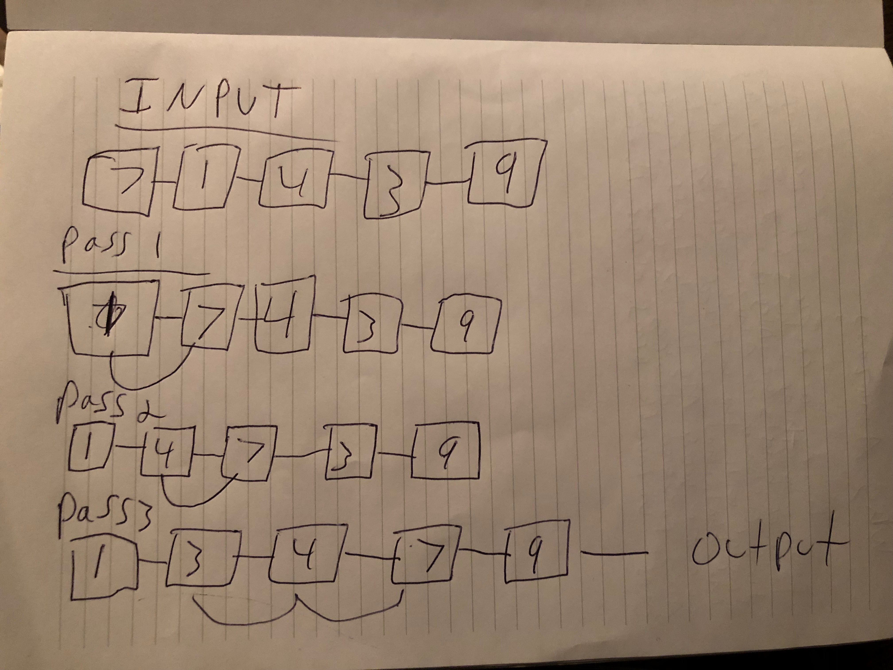
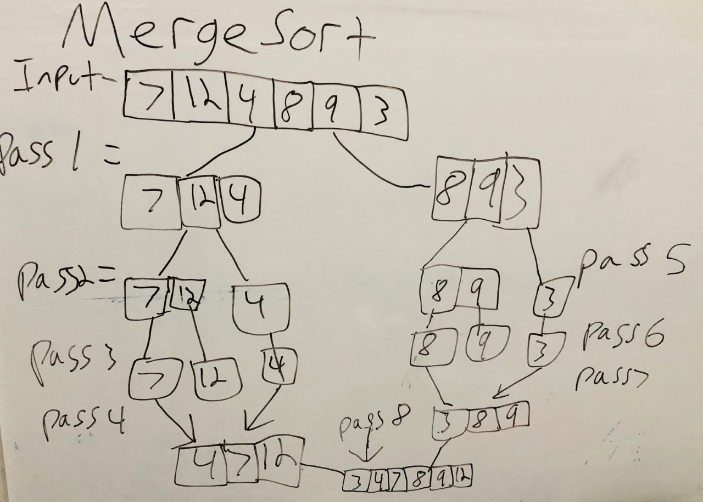

# SORTING BLOG

## Insertion Sort - 

### PSUEDO CODE 

The Psuedo Code was provided by codefellows 401d7 repo 

SelectionSort(int []arr)   
    DECLARE n <-- arr.Length; 
    FOR i = 0; i to n - 1  
        DECLARE min <-- i; 
        FOR j = i + 1 to n 
            if (arr[j] < arr[min]) 
                min <-- j; 
        DECLARE temp <-- arr[min]; 
        arr[min] <-- arr[i]; 
        arr[i] <-- temp; 
        
        
        
        
### WALKTHROUGH

        
### PASS ONE
 
 On the first Pass the algorithim will evaluate the 1 and 7 and the 1 will be found smaller and moved to the left.
 
### PASS TWO 
 
 On Pass two the 4 and the 7 will be evaluated and becuase 4 is less then 7 they will both remain in place.
 
### PASS THREE 
 
 The Third Pass demonstrates the true benefit of insertion sort, the three will be evaluated and is less then 7 so it will be pushed
 left one, then 3 will be evaluated with 4 and found smaller it will move left again. This will complete the algorithim leaving the array
 in a sorted form to return to the user. 
 
 
## EFFICIENCY
This will have an efficiency of 0 (n2) O of n squared. It is this efficiency because there are a for loop and a while loop being used, so it
will grow exponentially based on the size of the array. 

## Merge Sort - 

### PSUEDO CODE 

The Psuedo Code was provided by codefellows 401d7 repo 

ALGORITHM Mergesort(arr)
    DECLARE n <-- arr.length
           
    if n > 1
      DECLARE mid <-- n/2
      DECLARE left <-- arr[0...mid]
      DECLARE right <-- arr[mid...n]
      // sort the left side
      Mergesort(left)
      // sort the right side
      Mergesort(right)
      // merge the sorted left and right sides together
      Merge(left, right, arr)

ALGORITHM Merge(left, right, arr)
    DECLARE i <-- 0
    DECLARE j <-- 0
    DECLARE k <-- 0

    while i < left.length && j < right.length
        if left[i] <= right[j]
            arr[k] <-- left[i]
            i <-- i + 1
        else
            arr[k] <-- right[j]
            j <-- j + 1
            
        k <-- k + 1

    if i = left.length
       set remaining entries in arr to remaining values in right
    else
       set remaining entries in arr to remaining values in left
        
        
        
        
### WALKTHROUGH

        
### PASS ONE
 
 On the first Pass the algorithim will break the array into two seperate arrays.
 
### PASS TWO 
 
 On Pass two the left side gets called first and is broken down into two seperate arrays.
 
### PASS THREE 
 
On Pass three the left side is broken down further and is now ready for sorting. 

### PASS FOUR

On Pass four the left side is sorted and we are now ready to move onto the right side recursion.

### PASS FIVE

On Pass five the right side is broken down into two seperate arrays.

### PASS SIX 

On Pass Six the right side is broken down further and is ready for sorting.

### PASS SEVEN

On Pass Seven the right side is fully sorted. We now have two sorted halves ready for merging. 

### PASS EIGHT

The Final pass were the two remaining halves are merged and sorted!
 
 
 
 
## EFFICIENCY
This will have an efficiency of 0 (n2) O of n squared. It is this efficiency because there are a for loops and a while loop being used, so it will grow exponentially based on the size of the array. 

