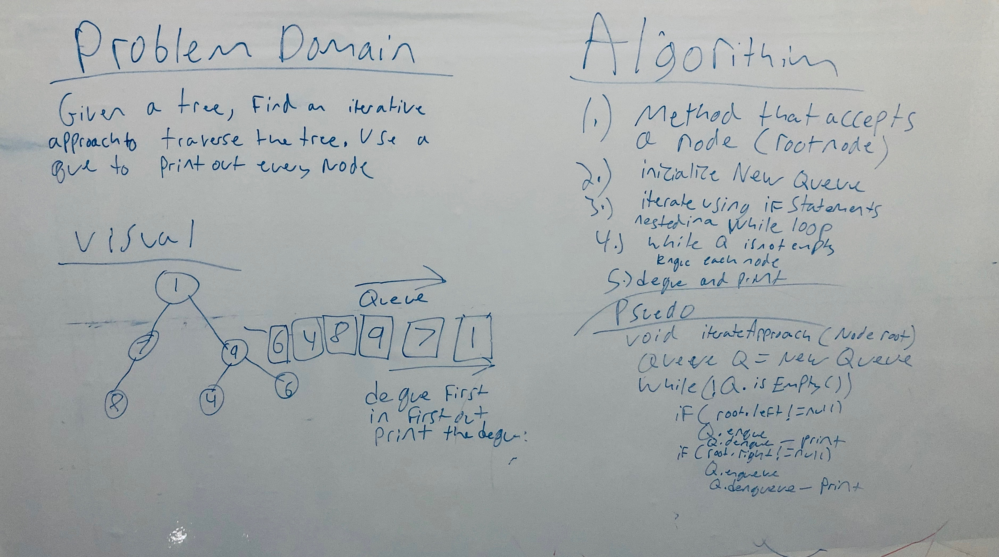
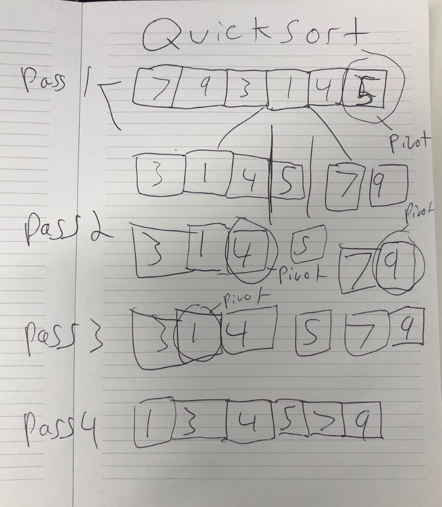
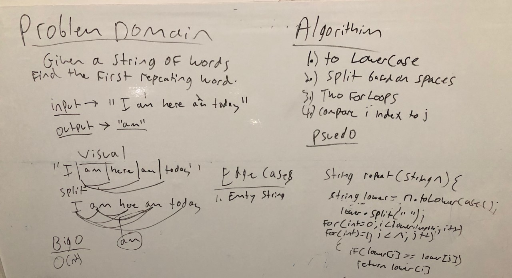
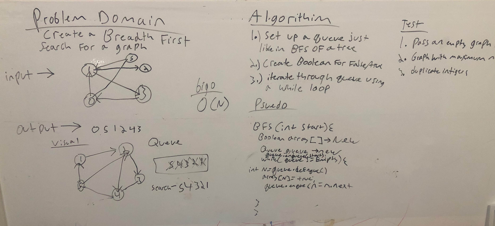
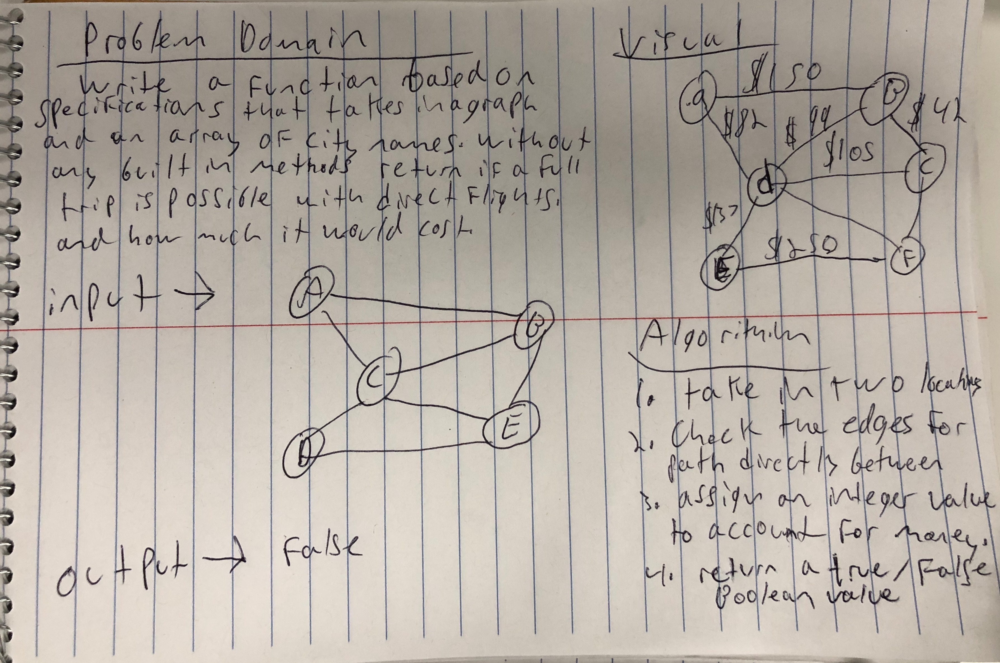
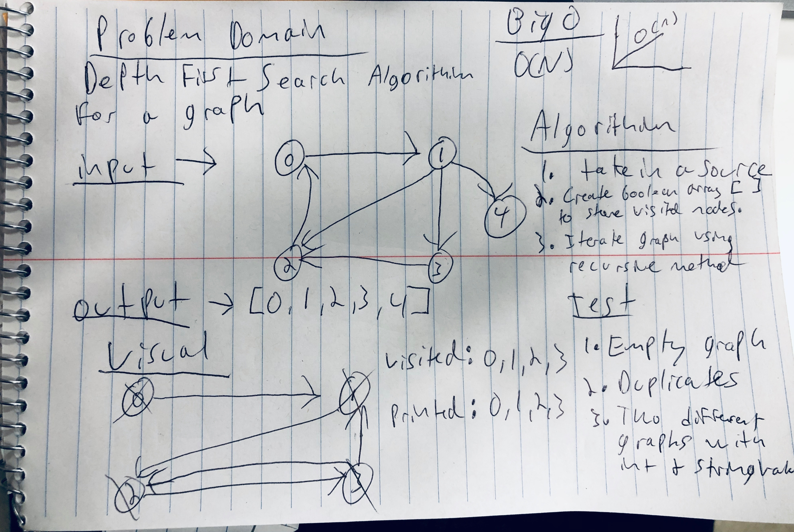

# java-data-structures-and-algorithms

# Reverse an Array
<!-- Short summary or background information -->
For this algorithim we took in an array of integers and reversed their order. 

## Challenge
<!-- Description of the challenge -->
The challenge was to reverse the order of the integers that were in the array

## Approach & Efficiency
<!-- What approach did you take? Why? What is the Big O space/time for this approach? -->
For this task we chose to use a while loop that had a int i set to 0 or the beginning, and int j set to the end which we used the length of the array for. We then used a temperary int to store the value of the array at position i then assigning position i to the number at the array at position j. Position j is then given the value of the temp which is the array at position i. Then position i is advanced one place and j is decresed one place until the whole array is sorted. 

while loop efficiency is 0 (n^2)

## Solution
<!-- Embedded whiteboard image -->

# InsertShift - Code challenge 2
<!-- Short summary or background information -->
For this algorithim we took an array and inserted a value into the middle index of the array

## Challenge
<!-- Description of the challenge -->
The challenge was to get the value inserted into the middle of the array.

## Approach & Efficiency
<!-- What approach did you take? Why? What is the Big O space/time for this approach? -->
For this we chose to create a new array that is the length of the old array + 1. We then start inserting the values of the old array into the new array with a for loop until if reaching the middle index. At the middle index the value is inserted into the array, then the next iteration the rest of the array is inputed. 

while loop efficiency is 0 (n^2)

## Solution
<!-- Embedded whiteboard image -->

# Binary Search - Code challenge 3
<!-- Short summary or background information -->
For this algorithim we took an array of sorted values and a key, and looked up the key using the binary search method. 

## Challenge
<!-- Description of the challenge -->
The challenge was to find the key efficiently using the binary search algorithim.

## Approach & Efficiency
<!-- What approach did you take? Why? What is the Big O space/time for this approach? -->
For this we decided to first set the an integer to the start of the array, and one to the end. We then found the middle and created a variable for it as well. We then created a while loop that would continue until the start was not less then the end. Then in the while loop we start by checking the middle position for the key, if not there we cut off half of the algorithim depending on if the key is less or greater then the middle. Then the start or end point is adjusted to the middle depending on the less or greater operation, and the middle is recalculated. The while process begins again on each iteration until the key is found. 

while loop efficiency is 0 (nlogn)

## Solution
<!-- Embedded whiteboard image -->

# Mock Interview - Code challenge 4
<!-- Short summary or background information -->
For this algorithim I had to run the fibbinocci algorithim

## Challenge
<!-- Description of the challenge -->
The challenge was to return the nth fibbinacci number 

## Approach & Efficiency
<!-- What approach did you take? Why? What is the Big O space/time for this approach? -->
For this I chose to do an iterative approach, I created a loop that would go n amount of times. I created integers n1, n2, and sum. I initated n1 to 0 and n2 to 1, sum to zero. On the first loop I added n1 and n2 to equal the sum. Then after that I set n1 equal to n2 and n2 equal to sum, and it loops again until it reaches the end and produces the nth fibbinocci number. 

while loop efficiency is 0(n)

## Solution
<!-- Embedded whiteboard image -->

# Singly Linked List
Create a singly linked list 

## Challenge
The challenge is to be able to insert values, find the values, and print out all the values. 

## Approach & Efficiency
searchNode(Node head, int n);
insert(int data);
toString(Node head);

## References 
For this lab geeks for geeks and stackoverflow were referenced for this lab

# Insertions - Code challenge 6
<!-- Short summary or background information -->
For this algorithim I had to insert a value before a given value, after a given value, and also appending a node.

## Challenge
<!-- Description of the challenge -->
The challenge was to insert a value before a given value, after a given value, and also appending a node.

## Approach & Efficiency
<!-- What approach did you take? Why? What is the Big O space/time for this approach? -->
For this I chose to do an iterative approach for all methods. They are were set up very similiarly. I created a new node named current, and set it equal to the head. I iterated through the loop and stopped to insert when the next one was the value to insert before for the before method. The after method was similiar but stopped one after and changed the next direction of the other nodes. 

while loop efficiency is 0(n)

## Solution
<!-- Embedded whiteboard image -->

# Insertions - Code challenge 7
<!-- Short summary or background information -->
For this algorithim I had to insert data into a node at the kth node from the end. The kth element was a value given by a user.

## Challenge
<!-- Description of the challenge -->
The challenge was to insert data into a node at the kth node from the end. The kth element was a value given by a user.

## Approach & Efficiency
<!-- What approach did you take? Why? What is the Big O space/time for this approach? -->
This was a tricky question, it took a while to get to the correct solution. In the end we set up a current node and ran it through a while loop while subtracting each round form an integer set to the kth value. This made it to the current node would stop the correct distance from the end. We then looped through a second time and when that current node reached the end then a newly created node was set to the correct spot becuase it was the kth distance behind current. 

while loop efficiency is 0(n)

## Solution
<!-- Embedded whiteboard image -->

## Solution
<!-- Embedded whiteboard image -->

# Insertions - Code challenge 8
<!-- Short summary or background information -->
For this algorithim we had to merge two linked lists.

## Challenge
<!-- Description of the challenge -->
The challenge was to merge two linked lists like a zipper. 

## Approach & Efficiency
<!-- What approach did you take? Why? What is the Big O space/time for this approach? -->
This was another tricky question. At first we came up with an iterative approach to merge from each list on a counter when it was even or odd. That method would work but we wanted to try to figure out a recursive approach similiar to fibbinacci. So we have the method taking in a parameter of two nodes, and each round it takes the value form the opposite linked list and inserts it. It's not alot of code but is more confusing for me then the itterative approach.
while loop efficiency is 0(n)

## Solution
<!-- Embedded whiteboard image -->

# Stacks and Ques - Lab 10
<!-- Short summary or background information -->

Create a Node class that has properties for the value stored in the Node, and a pointer to the next node.
Create a Stack class that has a top property. It creates an empty Stack when instantiated. 

# Classes
Node.java
Queue.java
Stack.java

# Methods

enqueue()
denqueue()
peek()
isEmtpy()
toString()
push()
Pop()
peek()

# Psuedo Queue - Code challenge 11
<!-- Short summary or background information -->
For this algorithim we had to create a queue using two stacks.

## Challenge
<!-- Description of the challenge -->
The challenge was to use two stacks in order to get the que to work. 

## Approach & Efficiency
<!-- What approach did you take? Why? What is the Big O space/time for this approach? -->
My aproach was not very efficient but I looped through the stack until it got to two from the end and it returned the last one and then deleted it by seting the next value of the second to last one to null. This turned the stack into a que with the added while loop. 
while loop efficiency is 0(n)

## Solution
<!-- Embedded whiteboard image -->

# Animal Shelter - Code challenge 12
<!-- Short summary or background information -->
For this algorithim we had to create an animal shelter queue to get animals in by the first in first out technique. 

## Challenge
<!-- Description of the challenge -->
The challenge was to create an animal constructor and pass it through a queue to remove the animals in the correct order. 

## Approach & Efficiency
<!-- What approach did you take? Why? What is the Big O space/time for this approach? -->
For this I created a class for dogs, in this class a created a constructor with the dogs properties. This acted as the node for the list. I then created an Enqueue and added the dogs to the queue. They are added at the back and exit the front when the dequeue is called. 
efficiency is 0(n)

## Solution
<!-- Embedded whiteboard image -->

# Bracket Validattion - Code challenge 13
<!-- Short summary or background information -->
For this algorithim we were tasked with creatung an algorithim that would validate brack syntax in java.
## Challenge
<!-- Description of the challenge -->
The challenge was to return true for valid bracked marking, such as {} or []{}. 

## Approach & Efficiency
<!-- What approach did you take? Why? What is the Big O space/time for this approach? -->
For this task I created a stack which I passed through the string given. If the stack found a bracket facing the wrong way before the left facing bracket was found then it will return false, if not it will return true. There are still some edge cases not accounted for that I am still working on solving.

This approach is 0(1)

## Solution
<!-- Embedded whiteboard image -->

# Binary Tree - Code challenge 15
<!-- Short summary or background information -->
For this algorithim we were tasked with creatung a a binary tree 
## Challenge
<!-- Description of the challenge -->
The challenge was to create a binary search tree that would have less values in the left child node, and greater values in the right child node. We also had to create methods to traverse the tree with only viewing each node once. 

## Approach & Efficiency
<!-- What approach did you take? Why? What is the Big O space/time for this approach? -->
For this lab there was alot of recursion used. For example a typical recursive method would first visit the root node, then its left child, then recursively pass that nodes left child until all left were complete, then it would move to the right. 

This approach is 0(n) becuase it will be greater depending on the size of the tree. 

## Solution
<!-- Embedded whiteboard image -->

# Binary Tree - Code challenge 16
<!-- Short summary or background information -->
For this algorithim we were tasked with creatung a a binary tree that would be evaluated to change the value to fizz, buzz, or fizzbuzz based on the data being divisible by 3 or 5 or both. 

<!-- Description of the challenge -->
The challenge was to have data that could use both string and integer. 

## Approach & Efficiency
<!-- What approach did you take? Why? What is the Big O space/time for this approach? -->
For this challenge I created a new node that had a string string for its data. It then evaluates the data and pushes it into a different data set that is evaluated in the test and returns the same as the  

This approach is 0(n) becuase it will be greater depending on the size of the tree. 

## Solution
<!-- Embedded whiteboard image -->

# Breath First Traversal - Code challenge 17
<!-- Short summary or background information -->
For this algorithim we were tasked with creatung a method to traverse a tree without using recursion, and creating an identical tree. 
<!-- Description of the challenge -->
The challenge was to figure out how to iterativaly traverse the tree. 

## Approach & Efficiency
<!-- What approach did you take? Why? What is the Big O space/time for this approach? -->
For this challenge I used a queue to enqueue the value as it is come across. This happened while the equeue is not empty and then if node.left was not empty it went that direction first, then node.right next.

This approach is 0(n) becuase it will be greater depending on the size of the tree. 

## Solution
<!-- Embedded whiteboard image -->

# Binary Tree MAX integer- Code challenge 18
<!-- Short summary or background information -->
For this algorithim we were tasked with finding the largest integer inside of the tree.

<!-- Description of the challenge -->
The challenge was to return the largest integer.

## Approach & Efficiency
<!-- What approach did you take? Why? What is the Big O space/time for this approach? -->
For this challenge I used recursion to come up with the answer. I first created an integer and set it to zero outside of the method. Then I created the method using the normal recursion used for inorder traversal with the change that I created logic that compared the max int to the current node data and if greater then max int took that value. Max int is returned at the end. 

This approach is 0(n) becuase it will be greater depending on the size of the tree. 

## Solution
<!-- Embedded whiteboard image -->

# Challenge Summary
The challenge was to create an insertion sort algorithim 

## Challenge Description
<!-- Description of the challenge -->
The challenge was to loop through an array of unsorted integers and organize them least to greatest using insertion short
method. The Insertion sort method takes a number that is less then the previous ones in the list and places it as far to the left as it can go. 

## Approach & Efficiency
<!-- What approach did you take? Why? What is the Big O space/time for this approach? -->

## Solution
<!-- Embedded whiteboard image -->

# Challenge Summary
The challenge was to create a Merge Sort algorithim 

## Challenge Description
<!-- Description of the challenge -->
The challenge was to take in an array of unsorted integers, and split it into two halfs over and over again until it is sorted. 

## Approach & Efficiency
<!-- What approach did you take? Why? What is the Big O space/time for this approach? -->
For this Approach I ussed recursion to split the array into two halfs over and over again and used the helper method merge to sort the halfs. This happens over and over again until it is fully sorted.

Big O is 0 (n2)

## Solution
<!-- Embedded whiteboard image -->

# Challenge Summary
The challenge was to create a Quick Sort algorithim 

## Challenge Description
<!-- Description of the challenge -->
The challenge was to take in an array of unsorted integers, and return a sorted array. 

## Approach & Efficiency
<!-- What approach did you take? Why? What is the Big O space/time for this approach? -->
For this Approach I used a pivot location to take everything less then it and place it on the left, and everything larger then it and place it on the right. I used recursion to split the array into two halfs over and over again and come together at the end sorted.

Big O is 0 (n2)

## Solution
<!-- Embedded whiteboard image -->

# Hashtables
<!-- Short summary or background information -->
For todays lab we had to create a hash table with the following methods:

add();  The add method will insert data into the hash table, dealing with collisions that occur. 
contains();  Contains will give give a true/false response to if the searched data exists in the hash table
get();    Get will retrieve the data that is being looked for. 
hash();    // hash method is what creates the index location for each item using a math algorithim
 

## Challenge
<!-- Description of the challenge -->

The challenge was to set up the entire data structure from scratch not using the built in hash mapping functionalitly.

## Efficiency
<!-- What approach did you take? Why? What is the Big O space/time for this approach? -->

The efficiency was 0(n) for the insertion and 0(n) for collisions becuase of the linked list being used every node needs to be visiting until the one looked for is found. 

# RepeatWord - Code challenge
<!-- Short summary or background information -->
For this algorithim we took in a String and had to return the first repeated word. 

## Challenge
<!-- Description of the challenge -->
The challenge was to find the first repeated word within the string. Also, to deal with edge cases such as empty string. 

## Approach & Efficiency
<!-- What approach did you take? Why? What is the Big O space/time for this approach? -->
For this I chose to first take the string and convert it into all lower case letters, I then split the string by the spaces between words and stored them in a string array. After that I used two for loops and compared the string at position i with position j (the innerloop) until it found one matching, the first one found is returned as that fulfills the requirements. 

 efficiency is 0 (n^2) because two forloops are usd. 

## Solution
<!-- Embedded whiteboard image -->

# TreeIntersection - Code challenge
<!-- Short summary or background information -->
For this algorithim we took in two binary trees and returned the integers that were present in both trees.

## Challenge
<!-- Description of the challenge -->
The challenge was to find Integers located in both trees and return a list of the, but not the others. 

## Approach & Efficiency
<!-- What approach did you take? Why? What is the Big O space/time for this approach? -->
For the whiteboard approach I chose to use the mor efficient hash table way, however I had issues implementing the code so I ended up just using two array lists and comparing the lists for duplicates.  First I use inorder traversal and place all nodes into an arraylist, then I use the retainAll() method to get a list of duplciates. 

 efficiency is 0 (n^2) because everynode is touched in both trees twice. 

## Solution
<!-- Embedded whiteboard image -->

# Graph - Code challenge
<!-- Short summary or background information -->
For todays lab we had to create a graph as an adjacency list.

The following methods were used:
Graph();
addNode();
addEdge();
getNeighbors();
getGraphSize();
printOutAll();

## Challenge
<!-- Description of the challenge -->
The challenge was to create a functioning graph with all of the required methods. 

## Approach 
<!-- What approach did you take? Why? What is the Big O space/time for this approach? -->
For this approach the grapgh is an adjacency list, and using the methos addNode()to add a node, addEdge() to add edges, getNeighbors() to get the neighbors of a node. getGraphSize() to return the size, and printOutAll() to print all nodes and their edges. 

# Graph Breadth First Search - Code challenge
<!-- Short summary or background information -->
For todays lab we had to create a function that used breadth first traversal of a graph. 

## Challenge
<!-- Description of the challenge -->
The challenge was to create a function that used breadth first traversal of a graph.

## Approach 
<!-- What approach did you take? Why? What is the Big O space/time for this approach? -->
For this approach I chose to use a queue use the level order traversal. THe method uses an array of booleans to check if a node has already been visited or not to account for duplicates. If it has not it is added to the queue and printed out on deEnqueue. 

## Solution
<!-- Embedded whiteboard image -->

# Count-edge - Code challenge
<!-- Short summary or background information -->
For todays lab we had to create a function that counts edges for a travel pattern. 

## Challenge
<!-- Description of the challenge -->
The challenge was to function that counts edges for a travel pattern. 

## Approach 
<!-- What approach did you take? Why? What is the Big O space/time for this approach? -->
In progress approach needs testing. 

## Solution
<!-- Embedded whiteboard image -->

# Depth First Search - Code challenge
<!-- Short summary or background information -->
For todays lab we had to create a function that performs a depth first search of a graph. 

## Challenge
<!-- Description of the challenge -->
The challenge was to create a function that performs a depth first search of a graph. 

## Approach 
<!-- What approach did you take? Why? What is the Big O space/time for this approach? -->
The approach was to do a recursive iteration of the graph, similiar to the approach taken with a binary tree. 
a few main differences though, this DFS will use an array of booleans to return a true value if a node has been visited, if it returns false then the node can be logged. If it is true then it will not be logged and it will move on. 

## Solution
<!-- Embedded whiteboard image -->

