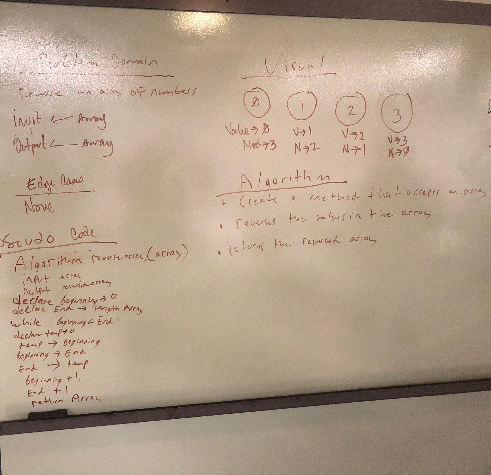

# java-data-structures-and-algorithms

# Reverse an Array
<!-- Short summary or background information -->
For this algorithim we took in an array of integers and reversed their order. 

## Challenge
<!-- Description of the challenge -->
The challenge was to reverse the order of the integers that were in the array

## Approach & Efficiency
<!-- What approach did you take? Why? What is the Big O space/time for this approach? -->
For this task we chose to use a while loop that had a int i set to 0 or the beginning, and int j set to the end which we used the length of the array for. We then used a temperary int to store the value of the array at position i then assigning position i to the number at the array at position j. Position j is then given the value of the temp which is the array at position i. Then position i is advanced one place and j is decresed one place until the whole array is sorted. 

while loop efficiency is 0 (n^2)

## Solution
<!-- Embedded whiteboard image -->

# InsertShift - Code challenge 2
<!-- Short summary or background information -->
For this algorithim we took an array and inserted a value into the middle index of the array

## Challenge
<!-- Description of the challenge -->
The challenge was to get the value inserted into the middle of the array.

## Approach & Efficiency
<!-- What approach did you take? Why? What is the Big O space/time for this approach? -->
For this we chose to create a new array that is the length of the old array + 1. We then start inserting the values of the old array into the new array with a for loop until if reaching the middle index. At the middle index the value is inserted into the array, then the next iteration the rest of the array is inputed. 

while loop efficiency is 0 (n^2)

## Solution
<!-- Embedded whiteboard image -->

# Binary Search - Code challenge 3
<!-- Short summary or background information -->
For this algorithim we took an array of sorted values and a key, and looked up the key using the binary search method. 

## Challenge
<!-- Description of the challenge -->
The challenge was to find the key efficiently using the binary search algorithim.

## Approach & Efficiency
<!-- What approach did you take? Why? What is the Big O space/time for this approach? -->
For this we decided to first set the an integer to the start of the array, and one to the end. We then found the middle and created a variable for it as well. We then created a while loop that would continue until the start was not less then the end. Then in the while loop we start by checking the middle position for the key, if not there we cut off half of the algorithim depending on if the key is less or greater then the middle. Then the start or end point is adjusted to the middle depending on the less or greater operation, and the middle is recalculated. The while process begins again on each iteration until the key is found. 

while loop efficiency is 0 (nlogn)

## Solution
<!-- Embedded whiteboard image -->

# Mock Interview - Code challenge 4
<!-- Short summary or background information -->
For this algorithim I had to run the fibbinocci algorithim

## Challenge
<!-- Description of the challenge -->
The challenge was to return the nth fibbinacci number 

## Approach & Efficiency
<!-- What approach did you take? Why? What is the Big O space/time for this approach? -->
For this I chose to do an iterative approach, I created a loop that would go n amount of times. I created integers n1, n2, and sum. I initated n1 to 0 and n2 to 1, sum to zero. On the first loop I added n1 and n2 to equal the sum. Then after that I set n1 equal to n2 and n2 equal to sum, and it loops again until it reaches the end and produces the nth fibbinocci number. 

while loop efficiency is 0(n)

## Solution
<!-- Embedded whiteboard image -->

# Singly Linked List
Create a singly linked list 

## Challenge
The challenge is to be able to insert values, find the values, and print out all the values. 

## Approach & Efficiency
searchNode(Node head, int n);
insert(int data);
toString(Node head);

## References 
For this lab geeks for geeks and stackoverflow were referenced for this lab

# Insertions - Code challenge 6
<!-- Short summary or background information -->
For this algorithim I had to insert a value before a given value, after a given value, and also appending a node.

## Challenge
<!-- Description of the challenge -->
The challenge was to insert a value before a given value, after a given value, and also appending a node.

## Approach & Efficiency
<!-- What approach did you take? Why? What is the Big O space/time for this approach? -->
For this I chose to do an iterative approach for all methods. They are were set up very similiarly. I created a new node named current, and set it equal to the head. I iterated through the loop and stopped to insert when the next one was the value to insert before for the before method. The after method was similiar but stopped one after and changed the next direction of the other nodes. 

while loop efficiency is 0(n)

## Solution
<!-- Embedded whiteboard image -->

# Insertions - Code challenge 7
<!-- Short summary or background information -->
For this algorithim I had to insert data into a node at the kth node from the end. The kth element was a value given by a user.

## Challenge
<!-- Description of the challenge -->
The challenge was to insert data into a node at the kth node from the end. The kth element was a value given by a user.

## Approach & Efficiency
<!-- What approach did you take? Why? What is the Big O space/time for this approach? -->
This was a tricky question, it took a while to get to the correct solution. In the end we set up a current node and ran it through a while loop while subtracting each round form an integer set to the kth value. This made it to the current node would stop the correct distance from the end. We then looped through a second time and when that current node reached the end then a newly created node was set to the correct spot becuase it was the kth distance behind current. 

while loop efficiency is 0(n)

## Solution
<!-- Embedded whiteboard image -->

# Insertions - Code challenge 8
<!-- Short summary or background information -->
For this algorithim we had to merge two linked lists.

## Challenge
<!-- Description of the challenge -->
The challenge was to merge two linked lists like a zipper. 

## Approach & Efficiency
<!-- What approach did you take? Why? What is the Big O space/time for this approach? -->
This was another tricky question. At first we came up with an iterative approach to merge from each list on a counter when it was even or odd. That method would work but we wanted to try to figure out a recursive approach similiar to fibbinacci. So we have the method taking in a parameter of two nodes, and each round it takes the value form the opposite linked list and inserts it. It's not alot of code but is more confusing for me then the itterative approach.
while loop efficiency is 0(n)

## Solution
<!-- Embedded whiteboard image -->

